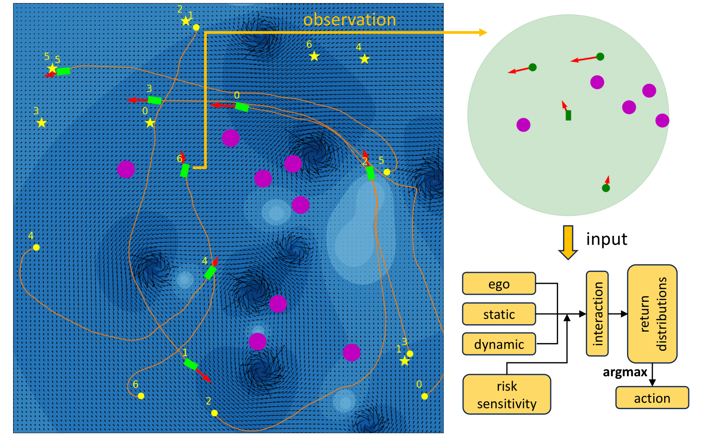

# Multi Robot Distributional RL Navigation

This repository contains the code implementation of our ICRA 2024 paper [here](https://arxiv.org/abs/2402.11799). We proposed a Distributional Reinforcement Learning (Distributional RL) based decentralized multi-robot collision avoidance method for Autonomous Surface Vehicles, which can work safely in congested waters with unknown current disturbances. Each vehicle equipped with the trained agent makes independent action decisions based on (1) ego observation of surrounding objects including static obstacles and other vehicles, and (2) level of risk sensitivity. The performance of our approach is shown in the video [here](https://robustfieldautonomylab.github.io/Lin_ICRA24_Video.mp4).

<p align="center">
 
</p>

## Train RL Agents

Our proposed Distributional RL based policy model (IQN), and a traditional RL based model (DQN) used for comparison, can be trained by running the following command. You can also skip this training section and run experiments with the provided pretrained models.  

```
python train_rl_agents.py -C CONFIG_FILE [-P NUM_PROCS] [-D DEVICE]
```

Replace CONFIG_FILE with the path to the training config file. Example training config files are provided in config directory.   

-P and -D flags are optional. -P can be used to specify the number of processes to be run in parallel when training multiple models. -D can be used to specify the CPU or GPU intended to be used in training.

## Evaluate Learning Performance

We provide scripts for plotting learning performance and visualizing evaluation episodes of RL agents trained by you.

To plot learning curves, set data_dir, seeds, and eval_agents according to the corresponding trained RL models, and run the command

```
python plot_eval_returns.py
```

To visualize an evaluation episode, set eval_id and eval_episode according to the corresponding evaluation config file, and run the command

```
python visualize_eval_episode.py
```

## Run Experiments

Run the following command to perform evaluation experiments. If you want to evaluate RL agents trained on your own, set save_dir in run_experiments.py to the stored directories.

```
python run_experiments.py
```

To visualize an experiment episode, set schedule_id, agent_id, ep_id according to the experiment result file, and run the command

```
python visualize_exp_episode.py
```
